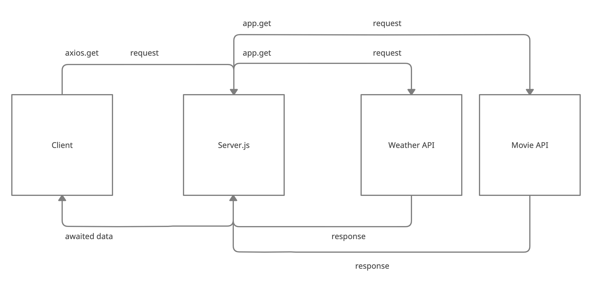

# LAB - 09

## City Explorer API

This is where the City Explorer API lives.

### Author: Mark Thanadabouth

### Collaborators: Phil Murphy, Wil J, Charlie F, Ryan G

### Links and Resources
* [Trello Board](https://trello.com/b/J5ZiKzZu/301n22-cityexplorere)
* [Deployed Server](https://city-explorer-server-301n22mt.herokuapp.com/)

* UML

> 

> 

### Reflections and Comments

* Server is still a bit fuzzy to comprehend.

## LAB 07

Name of feature: Add server

Estimate of time needed to complete: 4 hours

Start time: 1:30pm

Finish time: 7:23pm 08/01

Actual time needed to complete: 4 hours

## LAB - 08

Name of feature: Add live weather/server

Estimate of time needed to complete: 7 Hours

Start time: 2:50pm (08/03)

Finish time: 4:02pm (08/06)

Actual time needed to complete: 8 hours

## LAB - 09

Name of feature: Refactoring

Estimate of time needed to complete: 2 Hours

Start time: 1:00pm

Finish time: 2:20pm

Actual time needed to complete: 1 hour
